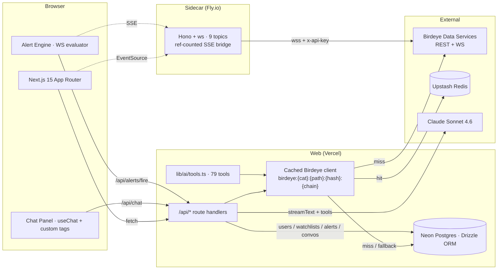

# AlphaOS

> **Bloomberg Terminal for onchain markets, powered by [Birdeye Data Services](https://bds.birdeye.so).** Every Birdeye REST endpoint and WebSocket stream wired into one product, plus an AI agent with tool access to all of them.

<p align="center"><em>Replace this line with the 30s demo GIF once exported.</em></p>

## What's inside

- **11 user-facing surfaces** — Discover, Token Lens, Pair Lens, Wallet Profiler, Trade Tape, Whale Radar, Memescope, Compare, Watchlists, Alerts (rules + history), AI Co-pilot.
- **79 typed REST endpoints** behind a cached client (Redis ➜ Postgres fallback) with credit-cost tracking per call and per user.
- **9 WebSocket topics** multiplexed by a standalone Hono+ws sidecar that fans out to browsers via SSE with reference-counted upstream subscriptions.
- **AI co-pilot** — Claude Sonnet 4.6 via Vercel AI SDK with all 79 endpoints registered as tools, custom-tag streaming output (`<chart/>`, `<holders/>`, `<wallet-card/>`, `<verdict/>`), and a one-shot Whale Radar auto-prompt.
- **Deterministic Wallet Verdict** — pure function, 11/11 unit-tested, classifies wallets into Alpha Trader / Sniper Bot / Hodler / Exit Liquidity / etc.
- **Watchlists + alert engine** — wallet activity, new listings, new pairs, whale-on-watchlist, token-stat thresholds. Toasts in-app, optional Telegram.

## Quick start

```bash
# 1. clone + install (root + workspace)
git clone <repo>
cd birdeye-alphaos
pnpm install

# 2. env
cp .env.example .env
#  required:  BIRDEYE_API_KEY, ANTHROPIC_API_KEY, DATABASE_URL,
#             UPSTASH_REDIS_REST_URL, UPSTASH_REDIS_REST_TOKEN
#  optional:  TELEGRAM_BOT_TOKEN, TELEGRAM_CHAT_ID

# 3. db
pnpm db:generate   # already generated; idempotent
pnpm db:migrate    # apply to your Neon db

# 4. tests + coverage
pnpm test:verdict  # 11/11
pnpm coverage      # asserts ≥ 75 endpoints + 9 ws topics

# 5. run
pnpm dev                                # web on :3000
pnpm --filter ws-sidecar dev            # sidecar on :4001 (separate terminal)
NEXT_PUBLIC_WS_SIDECAR_URL=http://localhost:4001 pnpm dev
```

## Architecture



## Surfaces

| # | Path | What it does |
| - | --- | --- |
| 1 | `/discover` | 7 chip-tabs (Trending · New Listings · Gainers · Losers · Smart Money · Memes · By DEX) with infinite scroll + sparklines |
| 2 | `/token/[chain]/[address]` | Token Lens — 8-call SSR header, lazy chart + WS price ticks, security/liquidity/holders/trades/top-traders/transfers/meme panels |
| 3 | `/pair/[chain]/[address]` | Pair Lens — chart with USD ↔ base/quote toggle, pair trade tape |
| 4 | `/wallet/[chain]/[address]` | Wallet Profiler — Verdict label + 5 tabs (Holdings · PnL · Transactions · Transfers · Origin) |
| 5 | `/tape` | Chain-wide trade firehose, rAF-batched buffer, block indicator |
| 6 | `/whales` | Large-trade WS + watchlist + sound + Telegram + AI auto-verdict |
| 7 | `/memes` | Memescope — sortable feed with `meme_stats` WS overlay |
| 8 | `/compare` | Side-by-side matrix · radar chart · correlation matrix · holder + top-trader overlap |
| 9 | `/settings/watchlists` | CRUD watchlists, ⭐ toggle on every detail page |
| 10 | `/settings/alerts` (+ `/history`) | Rule CRUD for 5 alert kinds + last-7-days fired log |
| 11 | AI co-pilot panel | 480 px slide-out, available from every page, 79 tools, custom-tag rendering |
| dev | `/_dev/ws` | Manual subscriber to all 9 WS topics for debugging |

## Endpoint coverage

> Generated by `pnpm coverage`. Re-run after adding endpoints; the script asserts ≥ 75 REST + 9 WS and fails CI otherwise.

**Summary: 79 / 79 REST endpoints cached + tooled · 9 / 9 WebSocket topics implemented.**

### REST endpoints

| Category | Endpoint | Function | Cached | AI tool | API route |
| --- | --- | --- | :-: | :-: | :-: |
| All-time & History | `GET /defi/v3/all-time/holders/single` | `getAllTimeHoldersSingle` | ✅ | ✅ | · |
| All-time & History | `GET /defi/v3/history/price` | `getHistoryPriceV3` | ✅ | ✅ | · |
| Balance & Transfer | `GET /defi/v3/balance/multi` | `getBalanceMulti` | ✅ | ✅ | · |
| Balance & Transfer | `GET /defi/v3/balance/token` | `getBalanceToken` | ✅ | ✅ | · |
| Balance & Transfer | `GET /defi/v3/balance/wallet` | `getBalanceWallet` | ✅ | ✅ | · |
| Balance & Transfer | `GET /defi/v3/transfers/multi` | `getTransfersMulti` | ✅ | ✅ | · |
| Balance & Transfer | `GET /defi/v3/transfers/recent` | `getTransfersRecent` | ✅ | ✅ | · |
| Balance & Transfer | `GET /defi/v3/transfers/token` | `getTransfersToken` | ✅ | ✅ | ✅ |
| Balance & Transfer | `GET /defi/v3/transfers/wallet` | `getTransfersWallet` | ✅ | ✅ | ✅ |
| Blockchain | `GET /defi/v3/blockchain/stats` | `getBlockchainStats` | ✅ | ✅ | ✅ |
| Blockchain | `GET /defi/v3/networks` | `getNetworks` | ✅ | ✅ | ✅ |
| Creation & Trending | `GET /defi/token_creation_info` | `getTokenCreationInfo` | ✅ | ✅ | · |
| Creation & Trending | `GET /defi/token_trending` | `getTokenTrending` | ✅ | ✅ | ✅ |
| Holder | `GET /defi/v3/token/holder` | `getTokenHolder` | ✅ | ✅ | ✅ |
| Holder | `GET /defi/v3/token/holder/active` | `getActiveHolders` | ✅ | ✅ | · |
| Holder | `GET /defi/v3/token/holder/distribution` | `getHolderDistribution` | ✅ | ✅ | ✅ |
| Holder | `GET /defi/v3/token/top_traders` | `getTopTraders` | ✅ | ✅ | ✅ |
| Holder | `GET /defi/v3/token/top_traders/list` | `getTopTradersList` | ✅ | ✅ | · |
| Meme | `GET /defi/v3/meme/list` | `getMemeList` | ✅ | ✅ | ✅ |
| Meme | `GET /defi/v3/meme/trending` | `getMemeTrending` | ✅ | ✅ | · |
| Price & OHLCV | `GET /defi/historical_price_unix` | `getHistoricalPriceUnix` | ✅ | ✅ | · |
| Price & OHLCV | `GET /defi/history_price` | `getHistoryPrice` | ✅ | ✅ | ✅ |
| Price & OHLCV | `GET /defi/multi_price` | `getMultiPrice` | ✅ | ✅ | · |
| Price & OHLCV | `GET /defi/ohlcv` | `getOhlcv` | ✅ | ✅ | · |
| Price & OHLCV | `GET /defi/ohlcv/base_quote` | `getOhlcvBaseQuote` | ✅ | ✅ | ✅ |
| Price & OHLCV | `GET /defi/ohlcv/pair` | `getOhlcvPair` | ✅ | ✅ | ✅ |
| Price & OHLCV | `GET /defi/price` | `getPrice` | ✅ | ✅ | · |
| Price & OHLCV | `GET /defi/price_volume/single` | `getPriceVolumeSingle` | ✅ | ✅ | ✅ |
| Price & OHLCV | `GET /defi/v3/ohlcv` | `getOhlcvV3` | ✅ | ✅ | ✅ |
| Price & OHLCV | `GET /defi/v3/ohlcv/pair` | `getOhlcvPairV3` | ✅ | ✅ | ✅ |
| Price & OHLCV | `POST /defi/multi_price` | `postMultiPrice` | ✅ | ✅ | ✅ |
| Price & OHLCV | `POST /defi/price_volume/multi` | `postPriceVolumeMulti` | ✅ | ✅ | · |
| Search & Utils | `GET /defi/networks` | `getLegacyNetworks` | ✅ | ✅ | ✅ |
| Search & Utils | `GET /defi/v3/search` | `search` | ✅ | ✅ | ✅ |
| Security | `GET /defi/token_security` | `getTokenSecurity` | ✅ | ✅ | · |
| Smart Money | `GET /trader/smart-money/list` | `getSmartMoneyList` | ✅ | ✅ | ✅ |
| Stats | `GET /defi/token_overview` | `getTokenOverview` | ✅ | ✅ | ✅ |
| Stats | `GET /defi/v3/pair/overview/single` | `getPairOverviewSingle` | ✅ | ✅ | ✅ |
| Stats | `GET /defi/v3/token/market-data` | `getTokenMarketData` | ✅ | ✅ | ✅ |
| Stats | `GET /defi/v3/token/meta-data/single` | `getTokenMetaDataSingle` | ✅ | ✅ | ✅ |
| Stats | `GET /defi/v3/token/trade-data/single` | `getTokenTradeDataSingle` | ✅ | ✅ | ✅ |
| Stats | `POST /defi/v3/pair/overview/multiple` | `postPairOverviewMultiple` | ✅ | ✅ | · |
| Stats | `POST /defi/v3/token/trade-data/multiple` | `postTokenTradeDataMultiple` | ✅ | ✅ | · |
| Token / Market List | `GET /defi/tokenlist` | `getTokenList` | ✅ | ✅ | · |
| Token / Market List | `GET /defi/v2/markets` | `getMarkets` | ✅ | ✅ | ✅ |
| Token / Market List | `GET /defi/v3/pair/list` | `getPairList` | ✅ | ✅ | · |
| Token / Market List | `GET /defi/v3/token/list` | `getTokenListV3` | ✅ | ✅ | ✅ |
| Token / Market List | `GET /defi/v3/token/list/scroll` | `getTokenListScroll` | ✅ | ✅ | ✅ |
| Transactions | `GET /defi/txs/pair` | `getTxsPair` | ✅ | ✅ | · |
| Transactions | `GET /defi/txs/pair/seek_by_time` | `getTxsPairSeekByTime` | ✅ | ✅ | ✅ |
| Transactions | `GET /defi/txs/token` | `getTxsToken` | ✅ | ✅ | · |
| Transactions | `GET /defi/txs/token/seek_by_time` | `getTxsTokenSeekByTime` | ✅ | ✅ | ✅ |
| Transactions | `GET /defi/v3/all-time/trades/single` | `getAllTimeTradesSingle` | ✅ | ✅ | ✅ |
| Transactions | `GET /defi/v3/large-trades` | `getLargeTrades` | ✅ | ✅ | ✅ |
| Transactions | `GET /defi/v3/pair/large-trades` | `getPairLargeTrades` | ✅ | ✅ | · |
| Transactions | `GET /defi/v3/pair/txs` | `getPairTxsV3` | ✅ | ✅ | ✅ |
| Transactions | `GET /defi/v3/pair/txs/recent` | `getPairTxsRecent` | ✅ | ✅ | · |
| Transactions | `GET /defi/v3/token/large-trades` | `getTokenLargeTrades` | ✅ | ✅ | ✅ |
| Transactions | `GET /defi/v3/token/txs` | `getTokenTxsV3` | ✅ | ✅ | ✅ |
| Transactions | `GET /defi/v3/token/txs/recent` | `getTokenTxsRecent` | ✅ | ✅ | · |
| Transactions | `GET /defi/v3/txs/recent` | `getTxsRecent` | ✅ | ✅ | ✅ |
| Transactions | `GET /trader/gainers-losers` | `getGainersLosers` | ✅ | ✅ | · |
| Transactions | `GET /trader/txs/seek_by_time` | `getTraderTxsSeekByTime` | ✅ | ✅ | ✅ |
| Transactions | `POST /defi/v3/all-time/trades/multiple` | `postAllTimeTradesMultiple` | ✅ | ✅ | · |
| Wallet, Networth & PnL | `GET /trader/wallet/holdings` | `getWalletHoldings` | ✅ | ✅ | · |
| Wallet, Networth & PnL | `GET /trader/wallet/pnl-detail` | `getWalletPnLDetail` | ✅ | ✅ | ✅ |
| Wallet, Networth & PnL | `GET /trader/wallet/pnl-summary` | `getWalletPnLSummary` | ✅ | ✅ | ✅ |
| Wallet, Networth & PnL | `GET /trader/wallet/positions` | `getWalletPositions` | ✅ | ✅ | · |
| Wallet, Networth & PnL | `GET /trader/wallet/realized-pnl` | `getWalletRealizedPnL` | ✅ | ✅ | · |
| Wallet, Networth & PnL | `GET /trader/wallet/unrealized-pnl` | `getWalletUnrealizedPnL` | ✅ | ✅ | · |
| Wallet, Networth & PnL | `GET /v1/wallet/list_supported_chain` | `listSupportedChain` | ✅ | ✅ | · |
| Wallet, Networth & PnL | `GET /v1/wallet/multichain_networth` | `getMultichainNetworth` | ✅ | ✅ | · |
| Wallet, Networth & PnL | `GET /v1/wallet/multichain_token_list` | `getMultichainTokenList` | ✅ | ✅ | · |
| Wallet, Networth & PnL | `GET /v1/wallet/multichain_tx_list` | `getMultichainTxList` | ✅ | ✅ | · |
| Wallet, Networth & PnL | `GET /v1/wallet/networth` | `getWalletNetworth` | ✅ | ✅ | ✅ |
| Wallet, Networth & PnL | `GET /v1/wallet/token_balance` | `getWalletTokenBalance` | ✅ | ✅ | ✅ |
| Wallet, Networth & PnL | `GET /v1/wallet/token_list` | `getWalletTokenList` | ✅ | ✅ | ✅ |
| Wallet, Networth & PnL | `GET /v1/wallet/tx_list` | `getWalletTxList` | ✅ | ✅ | ✅ |
| Wallet, Networth & PnL | `POST /v1/wallet/simulate` | `postWalletSimulate` | ✅ | ✅ | · |

> "API route" = a server-side `/api/*` handler proxies the call. Endpoints marked `·` are still cached + AI-callable; they're surfaced by the agent rather than by a dedicated handler.

### WebSocket topics

| Topic | Birdeye subscribe message | Surfaces |
| --- | --- | --- |
| `price` | `SUBSCRIBE_PRICE` | live ticks on Token Lens, Pair Lens, header price flash |
| `txs` | `SUBSCRIBE_TXS` | live trades on Token Lens, Pair Lens |
| `base_quote_price` | `SUBSCRIBE_BASE_QUOTE_PRICE` | Pair Lens "per QUOTE" mode |
| `new_listing` | `SUBSCRIBE_TOKEN_NEW_LISTING` | new-listing alert rule |
| `new_pair` | `SUBSCRIBE_NEW_PAIR` | new-pair alert rule |
| `large_trade` | `SUBSCRIBE_LARGE_TRADE_TXS` | Trade Tape, Whale Radar, whale-on-watchlist alerts |
| `wallet_txs` | `SUBSCRIBE_WALLET_TXS` | Wallet Profiler · Transactions tab · wallet-activity alerts |
| `token_stats` | `SUBSCRIBE_TOKEN_STATS` | Token Lens header MCap/holder ticker · stats-threshold alerts |
| `meme_stats` | `SUBSCRIBE_MEME_STATS` | Memescope live overlay |

## Stack

- **Web** — Next.js 15 App Router, React 19, TypeScript strict (`noUncheckedIndexedAccess`), Tailwind 3, shadcn-style primitives, TanStack Query, lightweight-charts (lazy), cmdk.
- **AI** — Claude Sonnet 4.6 via `@ai-sdk/anthropic@3` + `@ai-sdk/react@3` + `ai@6`.
- **Data** — Drizzle ORM + Neon Postgres (HTTP), Upstash Redis (REST), Postgres `cached_responses` fallback.
- **Realtime** — `services/ws-sidecar/` Hono + `ws`, deployed independently.
- **DX** — pnpm workspaces, native `node:test` for verdict, `tsx` for scripts, `drizzle-kit` for migrations.

## Scripts

```bash
pnpm dev                       # web on :3000
pnpm --filter ws-sidecar dev   # sidecar on :4001
pnpm test:client               # 5-endpoint Birdeye smoke test
pnpm test:verdict              # 11/11 wallet verdict unit tests
pnpm coverage                  # endpoint coverage report + assert
pnpm coverage:md               # just the markdown table
pnpm db:generate               # drizzle migrations
pnpm db:migrate                # apply migrations
pnpm typecheck                 # tsc --noEmit
pnpm build                     # next build
```

## Deploying

| Component | Target | Notes |
| --- | --- | --- |
| Web app | **Vercel** | `pnpm build`. Set `BIRDEYE_API_KEY`, `ANTHROPIC_API_KEY`, `DATABASE_URL`, `UPSTASH_REDIS_REST_URL`/`_TOKEN`, `NEXT_PUBLIC_WS_SIDECAR_URL=https://your-fly-app.fly.dev`. |
| WS sidecar | **Fly.io** | `cd services/ws-sidecar && fly launch --copy-config && fly secrets set BIRDEYE_API_KEY=… && fly deploy`. `auto_stop_machines = false` in [fly.toml](services/ws-sidecar/fly.toml) so the WS reconnect cost is paid once. |
| Postgres | **Neon** | Free tier is enough for the demo. `pnpm db:migrate` once the URL is set. |
| Redis | **Upstash** | REST creds; the cache layer falls back to Postgres if Redis is unreachable. |
| Telegram | optional | `TELEGRAM_BOT_TOKEN` + `TELEGRAM_CHAT_ID` enable Whale Radar + alert pushes. |

## Submission checklist

- [x] **≥ 75/78 REST endpoints used** — 79/79 cached + AI-tooled (`pnpm coverage`).
- [x] **9/9 WS topics used** — see table above.
- [x] **Verdict tests** — 11/11 (`pnpm test:verdict`).
- [x] **MIT license** — see [LICENSE](./LICENSE).
- [x] **Health endpoint** — `GET /api/health` returns 200 when DB + cache + Birdeye are all green, 503 otherwise.
- [ ] **Deployed URL** — fill in once Vercel + Fly are live.
- [ ] **Demo video** — 60–75 s, posted natively on X with @birdeye_data tag and #BirdeyeAPI.
- [ ] **Submission filed** — before May 2.

## Built with Birdeye Data Services

Every onchain primitive in this product comes from Birdeye Data Services. Get an API key at <https://bds.birdeye.so>.

## License

MIT — see [LICENSE](./LICENSE).
