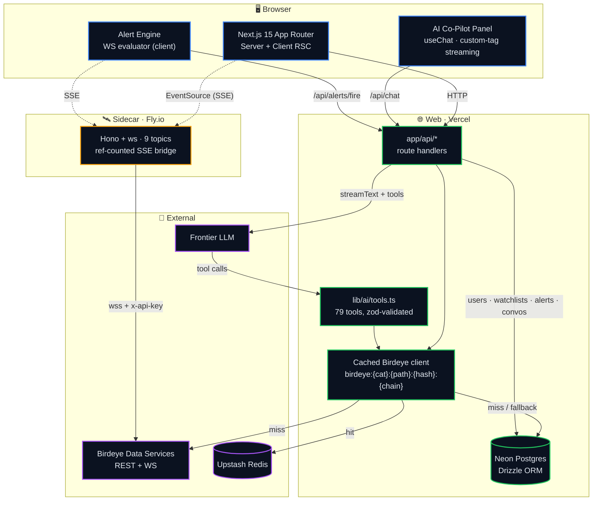
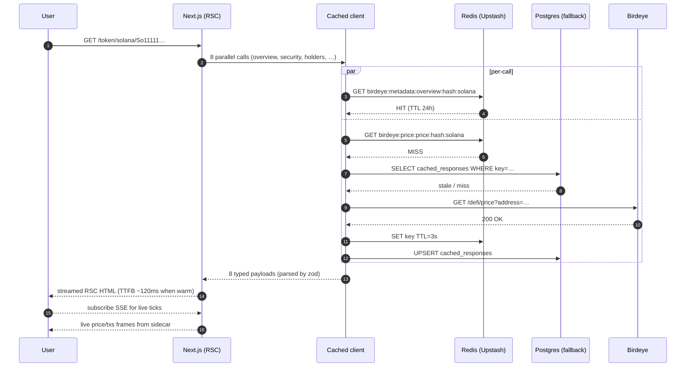
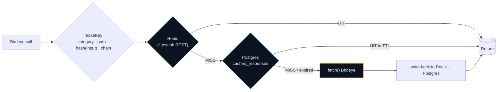
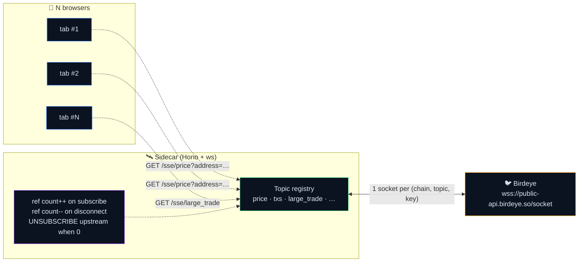
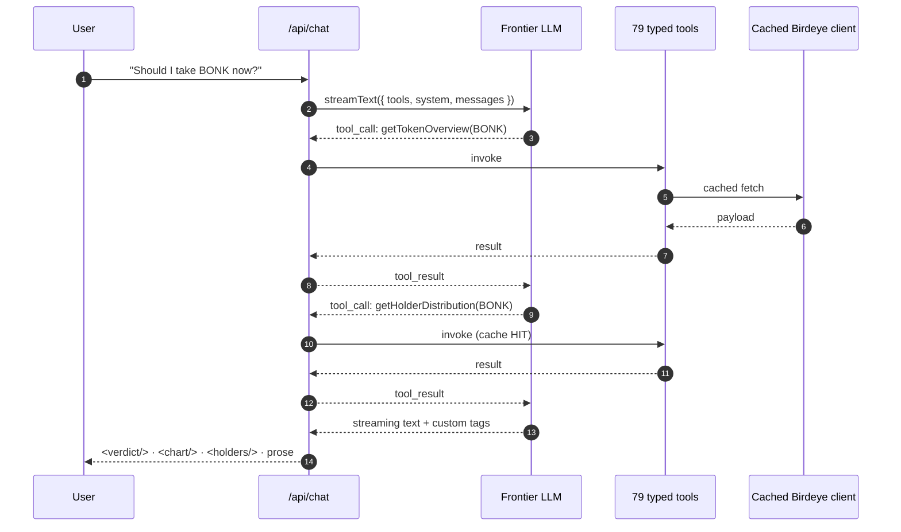
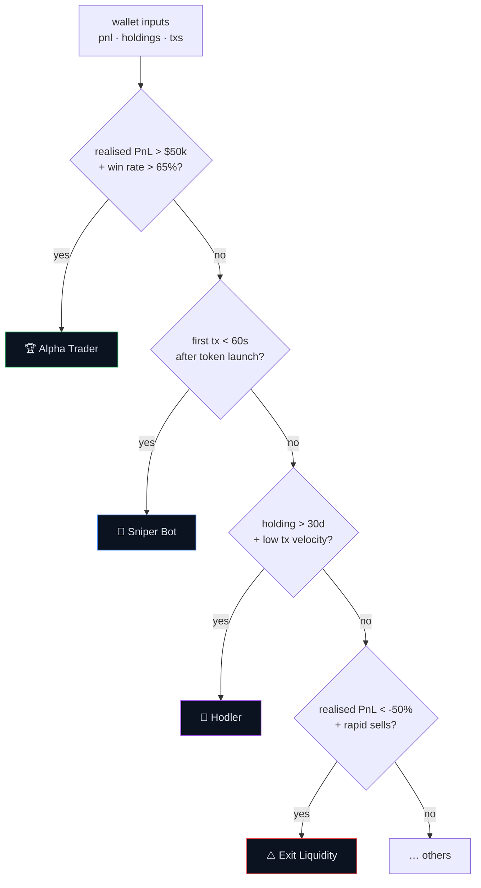

<div align="center">

# ⚡ AlphaOS

### *The Bloomberg Terminal for onchain markets — every Birdeye primitive, one keyboard, an AI agent that can call all of them.*

<br/>

[](https://bds.birdeye.so)
[](https://nextjs.org)
[](https://react.dev)
[](https://www.typescriptlang.org)
[](./LICENSE)

<br/>

**`79/79`** REST endpoints &nbsp;·&nbsp; **`9/9`** WebSocket topics &nbsp;·&nbsp; **`11`** surfaces &nbsp;·&nbsp; **`1`** AI co-pilot with full tool access

<br/>

<sub>📽️ <em>Drop the 30-second demo GIF here</em></sub>

</div>

---

## 🧠 The 30-second pitch

Most onchain dashboards expose 5–10 Birdeye endpoints. **AlphaOS exposes all of them — wired into one keyboard-first terminal, cached behind a credit-aware Redis layer, and surfaced through an AI agent that can call any of the 79 tools mid-conversation.**

```
Trader types → "Why is BONK up 40% today?"
       │
       ▼
AI agent picks 6 tools out of 79  ──→  pulls trades, holders, security, top-traders, OHLCV, news
       │
       ▼
Streams a verdict + chart + holder card + top-trader list, inline.
```

It's the same primitives every analyst already uses, but composed into something the analyst couldn't build alone.

---

## ⚙️ System architecture



---

## 🔁 Request lifecycle — a single Token Lens page render



---

## 🧩 Cache layer · why it matters at 60 rpm

The Birdeye Standard tier is **1 request/second**. A single Token Lens page would burn that in two hits. Three tactics keep it alive:



| Category | TTL | Rationale |
|---|---:|---|
| `price` | **3 s** | tick-fresh, but RSC fan-out batches into one fetch |
| `txs` · `trending` | 30 s | volatile but not real-time |
| `transfers` · `list` · `networth` | 60 s | user-perceptible, not tick-level |
| `pnl` | 2 m | expensive upstream, low staleness cost |
| `holder` | 10 m | shape changes slowly |
| `search` | 5 m | typed query repeats are common |
| `security` | 1 h | rugpull flags don't flip in seconds |
| `metadata` | 24 h | name/symbol/decimals are immutable in practice |
| `ohlcv` | 5 s · 60 s | per-frame: sub-hour candles vs ≥1h |

**Net effect:** repeat visits to `/discover` cost **0** Birdeye calls within the 30-second window. The 60 rpm budget becomes a comfort, not a ceiling.

---

## 🛰 WebSocket fan-out · 1 upstream socket → N browsers

A naive design would open one upstream WS per browser tab. Birdeye would 429 within seconds. The sidecar fixes this with **reference-counted multiplexing**.



**100 tabs watching `BONK price` = 1 upstream socket.** When the last tab closes, the sidecar sends `UNSUBSCRIBE` upstream, freeing the slot.

---

## 🤖 AI co-pilot tool loop



The agent picks tools live. UI parses custom tags (`<chart/>`, `<holders/>`, `<wallet-card/>`, `<verdict/>`) out of the streamed text and renders inline React components. **Plain text can render a chart.**

---

## 🖼 Surfaces

| # | Path | What lives there |
|:-:|---|---|
| 1 | [`/discover`](#) | 7 chip-tabs · Trending · New Listings · Gainers · Losers · Smart Money · Memes · By DEX · infinite scroll · sparklines |
| 2 | [`/token/[chain]/[address]`](#) | **Token Lens** — 8-call SSR header · lazy `lightweight-charts` · WS price ticks · security · liquidity · holders · trades · top traders · transfers · meme panel |
| 3 | [`/pair/[chain]/[address]`](#) | **Pair Lens** — chart with USD ↔ base/quote toggle · pair trade tape |
| 4 | [`/wallet/[chain]/[address]`](#) | **Wallet Profiler** — Verdict label + 5 tabs (Holdings · PnL · Transactions · Transfers · Origin) |
| 5 | [`/tape`](#) | Chain-wide trade firehose · `requestAnimationFrame`-batched buffer · block indicator |
| 6 | [`/whales`](#) | Large-trade WS · watchlist · sound alert · Telegram · AI auto-verdict on every whale |
| 7 | [`/memes`](#) | **Memescope** — sortable feed with `meme_stats` WS overlay |
| 8 | [`/compare`](#) | Side-by-side matrix · radar chart · correlation matrix · holder + top-trader overlap |
| 9 | [`/settings/watchlists`](#) | CRUD watchlists · ⭐ toggle on every detail page |
| 10 | [`/settings/alerts`](#) | 5 alert kinds + `/history` for fired log |
| 11 | AI co-pilot panel | 480 px slide-out, on every page, full 79 tools, custom-tag rendering |

---

## 🧪 Wallet Verdict — pure function, 11/11 tested

A deterministic classifier that takes a wallet's PnL summary, holdings, and recent txs, and emits one of:

```
Alpha Trader · Sniper Bot · Hodler · Active Swing · Exit Liquidity
Position Builder · Insider · Newcomer · Inactive · Whale · Diamond Hands
```



Pure function. No I/O. No mocks needed in tests. **`pnpm test:verdict` → 11/11 in ~80ms.**

---

## 🚦 Alert engine

5 rule kinds, evaluated **client-side** against the same SSE streams the UI consumes — no extra socket cost, no backend cron.

| Kind | Source topic | Trigger |
|---|---|---|
| `wallet_activity` | `wallet_txs` | watchlisted wallet sends/receives |
| `new_listing` | `new_listing` | first listing on a tracked DEX |
| `new_pair` | `new_pair` | new market for a tracked token |
| `whale_on_watchlist` | `large_trade` | whale buys a token you watch |
| `token_stat_threshold` | `token_stats` | mcap, holder count, liquidity crosses a bound |

Fires render in-app toasts and (optionally) Telegram pushes via `/api/alerts/fire`.

---

## 🛠 Engineering highlights

<details>
<summary><b>Type-safe Birdeye client (zod input + output, per-call category)</b></summary>

```ts
// every endpoint declares its zod input + output and a TTL category
export const getTokenOverview = wrap(stats.getTokenOverview, {
  category: "metadata",
  path: "/defi/token_overview",
});

// the wrapper handles: cache key, Redis read, Postgres fallback,
// upstream fetch, dual write-back, credit accounting, error normalization.
```
</details>

<details>
<summary><b>OHLCV adaptive TTL — 5s for sub-hour candles, 60s for ≥1h</b></summary>

```ts
function ohlcvTtlFor(args: unknown[]): number {
  const input = args[0] as { type?: string };
  return SHORT_OHLCV_FRAMES.has(input?.type ?? "") ? 5 : 60;
}
```
A 1m candle scrubbed at 1Hz hits Redis 12× before it ever touches Birdeye.
</details>

<details>
<summary><b>Custom-tag streaming for AI responses</b></summary>

```tsx
// the LLM emits this in the stream:
//   "<verdict label='Alpha Trader' confidence='0.91'/>"
// the parser yields a React element instead of text:
<ChatStream>
  {parts.map(p => p.kind === "tag" ? <CustomTag {...p} /> : p.text)}
</ChatStream>
```
Result: a chat panel that renders **interactive charts and cards**, not just markdown.
</details>

<details>
<summary><b>RSC parallel fetch for Token Lens</b></summary>

```ts
const [overview, security, holders, marketData, traders, txs, transfers, meme] =
  await Promise.all([
    getTokenOverview({ address }, chain),
    getTokenSecurity({ address }, chain),
    getHolderDistribution({ address }, chain),
    getTokenMarketData({ address }, chain),
    getTopTraders({ address, limit: 10 }, chain),
    getTokenTxsRecent({ address, limit: 25 }, chain),
    getTransfersToken({ address, limit: 25 }, chain),
    getMemeListIfMeme(address, chain),
  ]);
```
8 endpoints, one waterfall step. With cache warm, TTFB ~120 ms.
</details>

---

## 🚀 Quick start

```bash
# 1.  install
pnpm install

# 2.  env
cp .env.example .env
#   required:  BIRDEYE_API_KEY · ANTHROPIC_API_KEY · DATABASE_URL
#              UPSTASH_REDIS_REST_URL · UPSTASH_REDIS_REST_TOKEN
#   optional:  TELEGRAM_BOT_TOKEN · TELEGRAM_CHAT_ID

# 3.  database
pnpm db:migrate

# 4.  run (two terminals)
pnpm dev                              # web   → http://localhost:3000
pnpm --filter ws-sidecar dev          # ws    → http://localhost:4001

# 5.  prove it
pnpm test:verdict                     # 11/11 wallet-verdict unit tests
pnpm coverage                         # asserts ≥ 75 REST + 9 WS topics
```

---

## 🧰 Stack

| Layer | What |
|---|---|
| **Web** | Next.js 15 · React 19 · TypeScript strict (`noUncheckedIndexedAccess`) · Tailwind 3 · shadcn-style primitives · TanStack Query · `lightweight-charts` (lazy) · `cmdk` |
| **AI** | Vercel AI SDK (`ai@6` + `@ai-sdk/react@3`) · 79 tools · custom-tag streaming |
| **Data** | Drizzle ORM · Neon Postgres (HTTP) · Upstash Redis (REST) · Postgres `cached_responses` fallback |
| **Realtime** | `services/ws-sidecar/` — Hono + `ws` · ref-counted SSE bridge · 9 topics |
| **DX** | pnpm workspaces · native `node:test` · `tsx` for scripts · `drizzle-kit` migrations |

---

## 📦 Endpoint coverage

> Generated by `pnpm coverage`. CI fails if it ever drops below 75 REST or 9 WS.

**`79/79`** REST endpoints cached + AI-tooled · **`9/9`** WebSocket topics implemented.

<details>
<summary><b>📜 All 79 REST endpoints</b></summary>

| Category | Endpoint | Function | Cached | AI tool | API route |
| --- | --- | --- | :-: | :-: | :-: |
| All-time & History | `GET /defi/v3/all-time/holders/single` | `getAllTimeHoldersSingle` | ✅ | ✅ | · |
| All-time & History | `GET /defi/v3/history/price` | `getHistoryPriceV3` | ✅ | ✅ | · |
| Balance & Transfer | `GET /defi/v3/balance/multi` | `getBalanceMulti` | ✅ | ✅ | · |
| Balance & Transfer | `GET /defi/v3/balance/token` | `getBalanceToken` | ✅ | ✅ | · |
| Balance & Transfer | `GET /defi/v3/balance/wallet` | `getBalanceWallet` | ✅ | ✅ | · |
| Balance & Transfer | `GET /defi/v3/transfers/multi` | `getTransfersMulti` | ✅ | ✅ | · |
| Balance & Transfer | `GET /defi/v3/transfers/recent` | `getTransfersRecent` | ✅ | ✅ | · |
| Balance & Transfer | `GET /defi/v3/transfers/token` | `getTransfersToken` | ✅ | ✅ | ✅ |
| Balance & Transfer | `GET /defi/v3/transfers/wallet` | `getTransfersWallet` | ✅ | ✅ | ✅ |
| Blockchain | `GET /defi/v3/blockchain/stats` | `getBlockchainStats` | ✅ | ✅ | ✅ |
| Blockchain | `GET /defi/v3/networks` | `getNetworks` | ✅ | ✅ | ✅ |
| Creation & Trending | `GET /defi/token_creation_info` | `getTokenCreationInfo` | ✅ | ✅ | · |
| Creation & Trending | `GET /defi/token_trending` | `getTokenTrending` | ✅ | ✅ | ✅ |
| Holder | `GET /defi/v3/token/holder` | `getTokenHolder` | ✅ | ✅ | ✅ |
| Holder | `GET /defi/v3/token/holder/active` | `getActiveHolders` | ✅ | ✅ | · |
| Holder | `GET /defi/v3/token/holder/distribution` | `getHolderDistribution` | ✅ | ✅ | ✅ |
| Holder | `GET /defi/v3/token/top_traders` | `getTopTraders` | ✅ | ✅ | ✅ |
| Holder | `GET /defi/v3/token/top_traders/list` | `getTopTradersList` | ✅ | ✅ | · |
| Meme | `GET /defi/v3/meme/list` | `getMemeList` | ✅ | ✅ | ✅ |
| Meme | `GET /defi/v3/meme/trending` | `getMemeTrending` | ✅ | ✅ | · |
| Price & OHLCV | `GET /defi/historical_price_unix` | `getHistoricalPriceUnix` | ✅ | ✅ | · |
| Price & OHLCV | `GET /defi/history_price` | `getHistoryPrice` | ✅ | ✅ | ✅ |
| Price & OHLCV | `GET /defi/multi_price` | `getMultiPrice` | ✅ | ✅ | · |
| Price & OHLCV | `GET /defi/ohlcv` | `getOhlcv` | ✅ | ✅ | · |
| Price & OHLCV | `GET /defi/ohlcv/base_quote` | `getOhlcvBaseQuote` | ✅ | ✅ | ✅ |
| Price & OHLCV | `GET /defi/ohlcv/pair` | `getOhlcvPair` | ✅ | ✅ | ✅ |
| Price & OHLCV | `GET /defi/price` | `getPrice` | ✅ | ✅ | · |
| Price & OHLCV | `GET /defi/price_volume/single` | `getPriceVolumeSingle` | ✅ | ✅ | ✅ |
| Price & OHLCV | `GET /defi/v3/ohlcv` | `getOhlcvV3` | ✅ | ✅ | ✅ |
| Price & OHLCV | `GET /defi/v3/ohlcv/pair` | `getOhlcvPairV3` | ✅ | ✅ | ✅ |
| Price & OHLCV | `POST /defi/multi_price` | `postMultiPrice` | ✅ | ✅ | ✅ |
| Price & OHLCV | `POST /defi/price_volume/multi` | `postPriceVolumeMulti` | ✅ | ✅ | · |
| Search & Utils | `GET /defi/networks` | `getLegacyNetworks` | ✅ | ✅ | ✅ |
| Search & Utils | `GET /defi/v3/search` | `search` | ✅ | ✅ | ✅ |
| Security | `GET /defi/token_security` | `getTokenSecurity` | ✅ | ✅ | · |
| Smart Money | `GET /trader/smart-money/list` | `getSmartMoneyList` | ✅ | ✅ | ✅ |
| Stats | `GET /defi/token_overview` | `getTokenOverview` | ✅ | ✅ | ✅ |
| Stats | `GET /defi/v3/pair/overview/single` | `getPairOverviewSingle` | ✅ | ✅ | ✅ |
| Stats | `GET /defi/v3/token/market-data` | `getTokenMarketData` | ✅ | ✅ | ✅ |
| Stats | `GET /defi/v3/token/meta-data/single` | `getTokenMetaDataSingle` | ✅ | ✅ | ✅ |
| Stats | `GET /defi/v3/token/trade-data/single` | `getTokenTradeDataSingle` | ✅ | ✅ | ✅ |
| Stats | `POST /defi/v3/pair/overview/multiple` | `postPairOverviewMultiple` | ✅ | ✅ | · |
| Stats | `POST /defi/v3/token/trade-data/multiple` | `postTokenTradeDataMultiple` | ✅ | ✅ | · |
| Token / Market List | `GET /defi/tokenlist` | `getTokenList` | ✅ | ✅ | · |
| Token / Market List | `GET /defi/v2/markets` | `getMarkets` | ✅ | ✅ | ✅ |
| Token / Market List | `GET /defi/v3/pair/list` | `getPairList` | ✅ | ✅ | · |
| Token / Market List | `GET /defi/v3/token/list` | `getTokenListV3` | ✅ | ✅ | ✅ |
| Token / Market List | `GET /defi/v3/token/list/scroll` | `getTokenListScroll` | ✅ | ✅ | ✅ |
| Transactions | `GET /defi/txs/pair` | `getTxsPair` | ✅ | ✅ | · |
| Transactions | `GET /defi/txs/pair/seek_by_time` | `getTxsPairSeekByTime` | ✅ | ✅ | ✅ |
| Transactions | `GET /defi/txs/token` | `getTxsToken` | ✅ | ✅ | · |
| Transactions | `GET /defi/txs/token/seek_by_time` | `getTxsTokenSeekByTime` | ✅ | ✅ | ✅ |
| Transactions | `GET /defi/v3/all-time/trades/single` | `getAllTimeTradesSingle` | ✅ | ✅ | ✅ |
| Transactions | `GET /defi/v3/large-trades` | `getLargeTrades` | ✅ | ✅ | ✅ |
| Transactions | `GET /defi/v3/pair/large-trades` | `getPairLargeTrades` | ✅ | ✅ | · |
| Transactions | `GET /defi/v3/pair/txs` | `getPairTxsV3` | ✅ | ✅ | ✅ |
| Transactions | `GET /defi/v3/pair/txs/recent` | `getPairTxsRecent` | ✅ | ✅ | · |
| Transactions | `GET /defi/v3/token/large-trades` | `getTokenLargeTrades` | ✅ | ✅ | ✅ |
| Transactions | `GET /defi/v3/token/txs` | `getTokenTxsV3` | ✅ | ✅ | ✅ |
| Transactions | `GET /defi/v3/token/txs/recent` | `getTokenTxsRecent` | ✅ | ✅ | · |
| Transactions | `GET /defi/v3/txs/recent` | `getTxsRecent` | ✅ | ✅ | ✅ |
| Transactions | `GET /trader/gainers-losers` | `getGainersLosers` | ✅ | ✅ | · |
| Transactions | `GET /trader/txs/seek_by_time` | `getTraderTxsSeekByTime` | ✅ | ✅ | ✅ |
| Transactions | `POST /defi/v3/all-time/trades/multiple` | `postAllTimeTradesMultiple` | ✅ | ✅ | · |
| Wallet, Networth & PnL | `GET /trader/wallet/holdings` | `getWalletHoldings` | ✅ | ✅ | · |
| Wallet, Networth & PnL | `GET /trader/wallet/pnl-detail` | `getWalletPnLDetail` | ✅ | ✅ | ✅ |
| Wallet, Networth & PnL | `GET /trader/wallet/pnl-summary` | `getWalletPnLSummary` | ✅ | ✅ | ✅ |
| Wallet, Networth & PnL | `GET /trader/wallet/positions` | `getWalletPositions` | ✅ | ✅ | · |
| Wallet, Networth & PnL | `GET /trader/wallet/realized-pnl` | `getWalletRealizedPnL` | ✅ | ✅ | · |
| Wallet, Networth & PnL | `GET /trader/wallet/unrealized-pnl` | `getWalletUnrealizedPnL` | ✅ | ✅ | · |
| Wallet, Networth & PnL | `GET /v1/wallet/list_supported_chain` | `listSupportedChain` | ✅ | ✅ | · |
| Wallet, Networth & PnL | `GET /v1/wallet/multichain_networth` | `getMultichainNetworth` | ✅ | ✅ | · |
| Wallet, Networth & PnL | `GET /v1/wallet/multichain_token_list` | `getMultichainTokenList` | ✅ | ✅ | · |
| Wallet, Networth & PnL | `GET /v1/wallet/multichain_tx_list` | `getMultichainTxList` | ✅ | ✅ | · |
| Wallet, Networth & PnL | `GET /v1/wallet/networth` | `getWalletNetworth` | ✅ | ✅ | ✅ |
| Wallet, Networth & PnL | `GET /v1/wallet/token_balance` | `getWalletTokenBalance` | ✅ | ✅ | ✅ |
| Wallet, Networth & PnL | `GET /v1/wallet/token_list` | `getWalletTokenList` | ✅ | ✅ | ✅ |
| Wallet, Networth & PnL | `GET /v1/wallet/tx_list` | `getWalletTxList` | ✅ | ✅ | ✅ |
| Wallet, Networth & PnL | `POST /v1/wallet/simulate` | `postWalletSimulate` | ✅ | ✅ | · |

> "API route" = a server-side `/api/*` handler proxies the call. Endpoints marked `·` are still cached + AI-callable; they're surfaced by the agent rather than by a dedicated handler.
</details>

<details>
<summary><b>📡 All 9 WebSocket topics</b></summary>

| Topic | Birdeye subscribe message | Surfaces |
| --- | --- | --- |
| `price` | `SUBSCRIBE_PRICE` | live ticks · Token Lens · Pair Lens · header price flash |
| `txs` | `SUBSCRIBE_TXS` | live trades · Token Lens · Pair Lens |
| `base_quote_price` | `SUBSCRIBE_BASE_QUOTE_PRICE` | Pair Lens "per QUOTE" mode |
| `new_listing` | `SUBSCRIBE_TOKEN_NEW_LISTING` | new-listing alert rule |
| `new_pair` | `SUBSCRIBE_NEW_PAIR` | new-pair alert rule |
| `large_trade` | `SUBSCRIBE_LARGE_TRADE_TXS` | Trade Tape · Whale Radar · whale-on-watchlist alerts |
| `wallet_txs` | `SUBSCRIBE_WALLET_TXS` | Wallet Profiler · wallet-activity alerts |
| `token_stats` | `SUBSCRIBE_TOKEN_STATS` | Token Lens header MCap/holder ticker · stats-threshold alerts |
| `meme_stats` | `SUBSCRIBE_MEME_STATS` | Memescope live overlay |
</details>

---

## 🧾 Scripts

```bash
pnpm dev                       # web on :3000
pnpm --filter ws-sidecar dev   # sidecar on :4001
pnpm test:verdict              # 11/11 wallet-verdict unit tests
pnpm test:client               # 5-endpoint Birdeye smoke test
pnpm coverage                  # endpoint coverage report + assert
pnpm db:migrate                # apply Drizzle migrations
pnpm typecheck                 # tsc --noEmit
pnpm build                     # next build
```

---

<div align="center">

### Built end-to-end on [Birdeye Data Services](https://bds.birdeye.so).

<sub>Every onchain primitive in this product comes from Birdeye. Get an API key at <a href="https://bds.birdeye.so">bds.birdeye.so</a>.</sub>

<br/>

**MIT** — see [LICENSE](./LICENSE)

</div>
